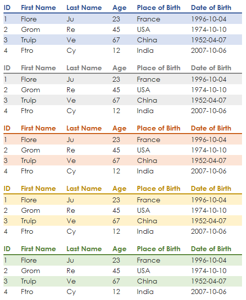
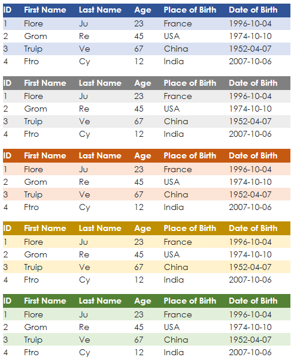

# pretty_html_table - Beautiful html tables made easy

`pretty_html_table` exists to convert a pandas DataFrame into a pretty html table for use in email.  The intended target audience is anyone who needs to send reports via email and would like to make their tables look more attractive.

12 different color themes are available. The output of the package embeds nicely with other packages used to send html emails, such as [email](https://docs.python.org/3/library/email.examples.html) or [O365](https://pypi.org/project/O365/).
The html formatting is set at the DataFrame row level, which allows nearly every email provider to parse it.  This obviates the need to grok out how the CSS may interact with the sending/recieving email provider.

Use [`pip`](https://pypi.org/project/pretty-html-table/) to install the package:

```
pip install pretty_html_table
```

A simple example to load an Excel file to a pandas DataFrame, convert it to html, and then save to an html file:

```
from pretty_html_table import build_table

df = pd.read_excel('df.xlsx')
html_table_blue_light = build_table(df, 'blue_light')

# Save to html file
with open('pretty_table.html', 'w') as f:
    f.write(html_table_blue_light)

# Compare to the pandas .to_html method:
with open('pandas_table.html', 'w') as f:
    f.write(df.to_html())
```

Use any browser to open `pretty_table.html` to see how the table would appear in an html email.


## Why choose pretty_html_table?

Output is ready to be sent via any Python package used to send emails. Insert the result of this package to the body of the email and voila.


## List of colors available

| Name          | font style     | Header                                                        | Rows                                                              |
|---------------|----------------|---------------------------------------------------------------|-------------------------------------------------------------------|
| 'blue_light'  | Century Gothic | Bold: yes / Background color: white / Font color: dark blue   | Odd background color: light blue / Even background color: white   |
| 'blue_dark'    | Century Gothic | Bold: yes / Background color: dark blue / Font color: white   | Odd background color: light blue / Even background color: white   |
| 'grey_light'   | Century Gothic | Bold: yes / Background color: white / Font color: dark grey   | Odd background color: light grey / Even background color: white   |
| 'grey_dark'    | Century Gothic | Bold: yes / Background color: dark grey / Font color: white   | Odd background color: light grey / Even background color: white   |
| 'orange_light' | Century Gothic | Bold: yes / Background color: white / Font color: dark orange | Odd background color: light orange / Even background color: white |
| 'orange_dark'  | Century Gothic | Bold: yes / Background color: dark orange / Font color: white | Odd background color: light orange / Even background color: white |
| 'yellow_light' | Century Gothic | Bold: yes / Background color: white / Font color: dark yellow | Odd background color: light yellow / Even background color: white |
| 'yellow_dark'  | Century Gothic | Bold: yes / Background color: dark yellow / Font color: white | Odd background color: light yellow / Even background color: white |
| 'green_light'  | Century Gothic | Bold: yes / Background color: white / Font color: dark green  | Odd background color: light green / Even background color: white  |
| 'green_dark'   | Century Gothic | Bold: yes / Background color: dark green / Font color: white  | Odd background color: light green / Even background color: white  |
| 'red_light'  | Century Gothic | Bold: yes / Background color: white / Font color: dark red | Odd background color: light red / Even background color: white  |
| 'red_dark'   | Century Gothic | Bold: yes / Background color: dark red / Font color: white  | Odd background color: light red / Even background color: white  |


## Example of an integration with the O365 package

First, create a function to send an email:

```
from O365 import Account

# Never hard code credentials or store them in a repo
# Use environmental variables instead

credentials = (o365credid, o365credpwd)
account = Account(credentials)

def send_email(account, to, subject, start, body, end):
    m = account.new_message()
    m.to.add(to)
    m.subject = subject
    m.body = start + body + end
    m.send()
```

Then create the start and end of an email in html:

```
start = """<html>
                <body>
                    <strong>Data table here:</strong><br />"""


end = """       </body>
            </html>"""
```

Finally we can utilize `pretty_table_html` to convert our Excel file and send the email:

```
from pretty_html_table import build_table

html_table_blue_light = build_table(pd.read_excel('df.xlsx'), 'blue_light')

send_email(account
           , 'test@any.com'
           , 'test table'
           , start
           , html_table_blue_light
           , end
           )
```

Here are all of the currently available colors: 




## Additional arguments
Several optional arguments now exist that allow the user to control the table's font, font size, and alignment:

* `font_size` - accepts absolute keywords (`medium`) and pixel values (`20px`)
* `font_family` - best practice is to include a generic font family in case a recipient's client cannot render the chosen font.  The example below designates `Open Sans` as a font, but designates the generic `sans-serif` family as a fallback.  It's possible that the fallback font may be utilized in case a recipient has web fonts blocked for security reasons, or if they are viewing the email on a client that does not have acces to Google Fonts.
* `text_align` - accepts standard html property values such as `left`, `right`, `center`, `justify`.
* `width` - accepts string representation of pixels. For instance, for the columns to have a width of 100px, you would write: width="100px".
* `width_dict` - accepts list of string representation of pixels. It will only work if the length of the list matches the number of columns of your pandas dataframe. You can for example provide the following argument to the fonction: width_dict=['300px','auto', 'auto', 'auto','auto', 'auto'] only the first column would be resized to 300px, the other would be "auto".
* `index` - bolean. False by default - If you write index=True, index of the dataframe will then be visible in your table.
* `even_color` - accepts string representation of colors (either "white" or "FFFFF"). For instance, for the font color of the even lines to be white, you would write: even_color='white'.
* `color` - accepts string representation of colors (either "white" or "FFFFF"). For instance, for the background color of the even lines to be black, you would write: even_color='black'.
* `conditions` - accepts dictionnary providing the following information: <name_of_column>: `{'min': <min range>,'max': <max range>,'min_color': <color_for_min>,'max_color': <color_for_max>}` Below is an exmaple, if a column name is "Age" and we wish to have the ages represented in red if they are under 25 and green if they are over 60.
* `padding` - accepts a string to set the CSS padding in the table (`10px`, `0px 20px`, `0px 20px 0px 0px`) 
* `odd_bg_color` - accepts a hex or standard color for the odd row background 
* `border_bottom_color` - accepts a color for the bottom border for the headers


```
html_table = build_table(df
            , 'yellow_dark'
            , font_size='medium'
            , font_family='Open Sans
            , sans-serif'
            , text_align='left'
            , width='auto'
            , index=False
            ,conditions={
                'Age': {
                    'min': 25,
                    'max': 60,
                    'min_color': 'red',
                    'max_color': 'green',
                }
            }
			, even_color='black'
			, even_bg_color='white')
```
